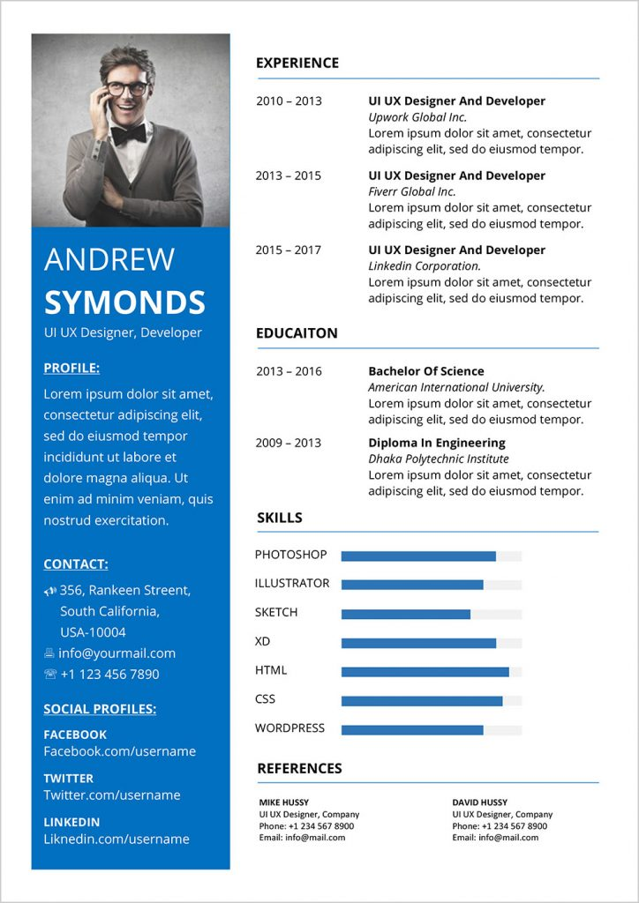

# 🚀 UNILINK: Smart Student Ecosystem  

> 🌟 *Your All-in-One Digital Campus Companion*  
> Developed with ❤️ by Team **SHIP-MATES** during the **ISHIP Internship Program (6-Day Innovation Sprint)**  
---

## 🌐 **Live Demo**
🔗 [Explore UNILINK](https://lnkd.in/gFuKDhwH)

---

## 🧠 **About the Project**

**UNILINK** is an innovative web platform designed to **empower students** by combining all essential campus services into one smart ecosystem.  

From **wellness tracking** to **resume building**, **hackathons**, **idea sharing**, and **book exchange**, UNILINK provides everything a student needs — right at their fingertips.  

🎯 **Vision:**  
To create a connected, engaging, and growth-oriented digital campus for every student.  

---

## ✨ **Key Features**

| 🌟 Feature | 💡 Description |
|------------|----------------|
| 💬 **Idea Sharing Hub** | Share, discuss, and collaborate on ideas with peers and mentors. |
| 🏫 **Campus Connect** | Stay updated with campus announcements, events, and opportunities. |
| 📄 **Resume Builder** | Instantly generate a professional, ATS-friendly resume. |
| 📚 **CampusX – Book Exchange** | Buy, sell, or swap academic books with other students. |
| 🏆 **Hackathons & Events** | Explore upcoming hackathons, workshops, and competitions. |
| ❤️ **Wellness Tracker** | Monitor your mental and physical well-being with interactive tools. |
| 🧩 **Puzzle Zone** | Enhance problem-solving skills through engaging puzzles. |

---

## 🛠 **Tech Stack**

| 🧩 Technology | ⚙️ Purpose |
|----------------|-------------|
| **HTML5** | Building structured and responsive pages |
| **CSS3** | Designing elegant and modern interfaces |
| **JavaScript (Vanilla JS)** | Adding interactivity and functionality |

---

## 👩‍💻 **Team SHIP-MATES**

| 👤 Name | 🎯 Role |
|----------|---------|
| **Akshaya P** | Frontend Developer |
| **Neeraja L** | UI/UX Designer |
| **Jyothirmayi Bandharu** | Workflow Coordinator |
| **Srisucha Kalari** | Web Developer |
| **Siddu Kuchula** | Full Stack Developer |

---

## 🧭 **Our Journey**

We built **UNILINK** in just **6 days** as part of the **ISHIP 2025 Internship Program**.  
Every team member contributed their creativity and expertise to transform a simple idea into a complete, functional student ecosystem.  

This project symbolizes our **dedication, teamwork, and innovation** in turning challenges into real-world solutions.  

---

## 🙏 **Special Thanks To**

A heartfelt thanks to our mentors and guides for their continuous support and motivation:  
**Babji Neelam Sir**, **Chandrika Neelam Mam**, **Kiran Kumar Sir**, **Durga Sai Prasad Ganapathi Sir**, **Hanumanthu Buddha Sir**,  
**Madhukumar Munjuluri Sir**, **Girish Varri Sir**, **Gangadhar Jami Sir**, and **Sathish Lutukurthi Sir** 🙌  

---

## 🌟 **Why UNILINK Stands Out**

✅ Combines **academic, career, and personal growth tools** in one platform  
✅ Promotes **collaboration, innovation, and engagement**  
✅ Built with **modern UI/UX** and optimized for accessibility  
✅ Reflects **real-world development, teamwork, and project management skills**  

---

## 📸 **Project Preview**

---

## 🧾 **Project Summary**

| 🔖 Attribute | 📘 Details |
|--------------|------------|
| **Duration** | 6 Days (ISHIP 2025) |
| **Domain** | Student Ecosystem / EdTech |
| **Type** | Web-Based Platform |
| **Objective** | Empower students through a unified digital ecosystem |

---

## 🚀 **Future Enhancements**

- 🔒 Secure user authentication with login system  
- ☁️ Database integration for user data storage  
- 🤖 AI-powered career and course recommendations  
- 💬 Real-time chat and notification system  
- 📱 Fully responsive mobile version  

---

## 💬 **Connect with Me**

👨‍💻 **Developer:** *Siddu Kuchula*  
💼 **LinkedIn:** [linkedin.com/in/siddukuchula](https://linkedin.com/in/siddukuchula)  
🌍 **GitHub:** [github.com/SidduKuchula](https://github.com/SidduKuchula)  
📧 **Email:** siddukuchula@gmail.com  

---

> 💡 *“UNILINK isn’t just a project — it’s your digital campus companion that connects dreams, ideas, and opportunities.”* ✨  

---

⭐ If you like this project, don’t forget to star it on GitHub! ⭐

